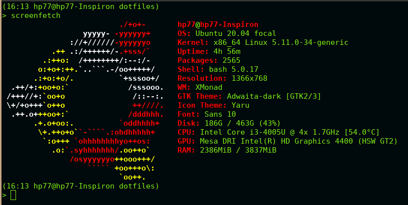
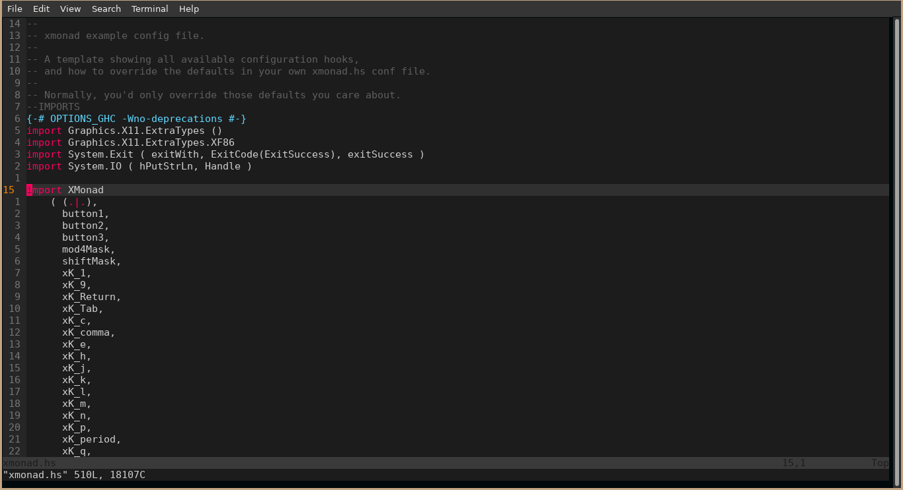
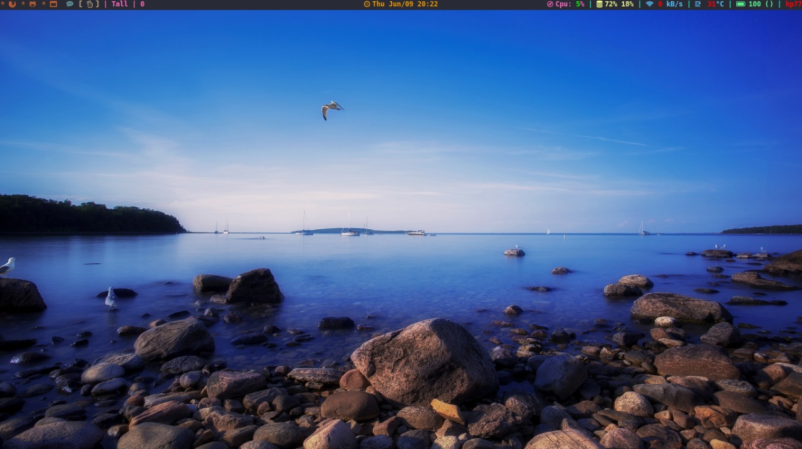
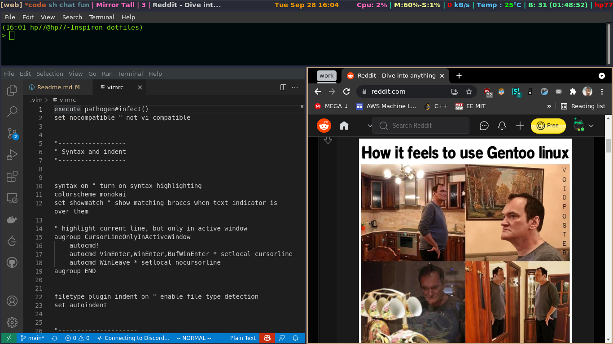
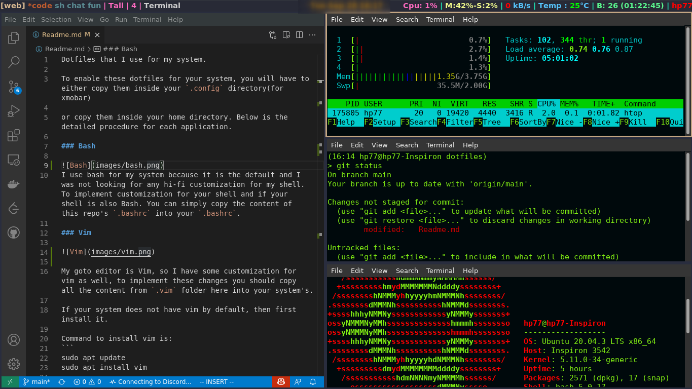
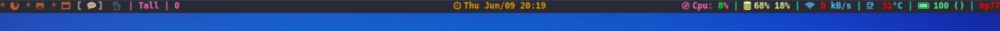
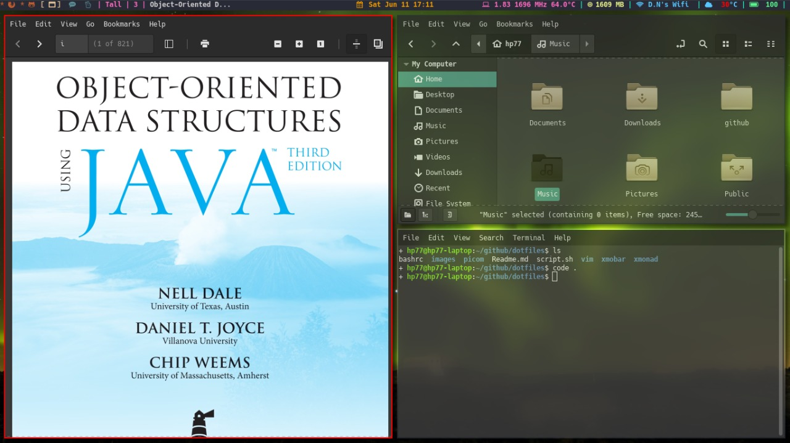

Dotfiles that I use for my system.

<details>
<summary><strong>Backstory</strong></summary>
I fell in love with Vim and type of speed that it provides me and also the independence from the mouse.
But the benefit was limited to only editor or when I was writing code.
I wanted a system where Vim like keybindings are everywhere.
I dig up internet to look for solutions which will make me use vim-like keybindings everywhere and came across the beautiful community of [Unixporn](www.reddit.com/r/unixporn), where different Linux users from around globe share their desktop customizations(known as rice) and from there I got to know of [DistroTube(DT)](https://www.youtube.com/channel/UCVls1GmFKf6WlTraIb_IaJg), this guy has a lot of videos on window manager and configs and what not.
I looked functionalities of different windows manager but only Xmonad caught my eye because of its simplicity and Vim like keybindings and Here I am. :laughing: . 
</details>


To use these dotfiles for your system, you will have:
- copy `xmobar` inside your `.config` directory(for xmobar) 
- copy `xmonad` in your `~` under directory name `.xmonad`

or copy them inside your home directory. Below is the detailed procedure for each application.

### Bash


I use bash for my system because it is the default and I was not looking for any hi-fi customization for my shell. To implement customization for your shell and if your shell is also Bash. You can simply copy the content of this repo's `bashrc` into your `.bashrc`.

### Vim



My goto editor is Vim, so I have some customization for vim as well, to implement these changes you should copy all the content from `.vim` folder here into your system's.

If your system does not have vim by default, then first install it.

Command to install Vim in system with `apt` package manager is:
```
sudo apt update
sudo apt install vim

```

### Xmonad





xmonad in Mirror Tall mode


xmonad in FullScreen mode


It is a windows manager which can be configured using haskell language. By default, Ubuntu uses Gnome as its window manager but Gnome comes with lot of stuff which you usually do not need, so switching to more suckless windows manager is a good experience. And Xmonad helps to do just that.

There are different types of application in use, so you will have to ensure that they are installed on your system. Detailed setup will be updated soon.


To install it on ubuntu, follow steps provided in [here](https://beginners-guide-to-xmonad.readthedocs.io/installing_xmonad.html)

To be able to fully implement all the settings from the given xmonad.hs, you will have to have some tools already installed in your system, like:

- xdotool

This pkg lets you use your mouse on xmobar and make it clickable.

```
sudo apt-get update -y
sudo apt-get install xdotool 
```


- xmobar

With Xmonad it is essential to have Xmobar. Xmobar is a bar like application where you can customize what updates/information you want to display.




```
sudo apt-get update -y
sudo apt-get install xmobar
```

- lxappearance(for changing GTK+ theme)

```
sudo apt-get update -y
sudo apt-get install -y lxappearance
```

- picom(for aesthetic look and effect)

    [link](https://github.com/yshui/picom) for instruction on how to install picom and a configuration file is provided in [here](picom/picom.conf).




- lux(for controlling backlight)


```bash
$ git clone https://github.com/Ventto/lux.git
$ cd lux
$ sudo make install
```

:warning: Android Emulator will not work properly, add following lines to the config to make it work

```haskell
myManageHook = composeAll 
[ ....
, stringProperty "_NET_WM_NAME" =? "Emulator" --> doFloat
]
```


- Script for getting battery low notification

I created a `cronjob` for the same following this [link](https://hep.uchicago.edu/~tlatorre/power_warning.html). I have also added the script inside `xmonad` directory in case you don't want to copy paste from the website
You will have to also install `xosd-bin` it is a tool which helps to display messages on screen in X-Display.

```bash
sudo apt update
sudo apt install xosd-bin
```


- Step to create the `cronjob` is:

```bash
> crontab -e
```

```bash
DISPLAY=0.0
PATH=/usr/bin

* * * * * python3 ~/.xmonad/power.py
```

[source of this info](https://abhixec.com/posts/xmonadandandroidstudio.html)

### Links

Some helpful links that got me through the config of my system, you can explore these and have something of your own. 

- [DistroTube](https://www.youtube.com/channel/UCVls1GmFKf6WlTraIb_IaJg)
- [r/unixporn](https://www.reddit.com/r/unixporn/)
- [Good guide for theme and config](https://gist.github.com/freizl/3246474)


<p align="center">Thanks for checking out the repo. Have a good day. :heart: </p>
