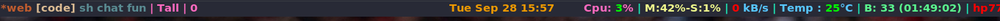

Dotfiles that I use for my system.

<details>
<summary><strong>Backstory</strong></summary>
I got infatuated with vim and type of speed that it granted me and also the independence from the keyboard in the process.
But except in editor, I couldn't use my keyboard shortcuts that I learnt via Vim, I wanted to change that.
I looked for it on internet and came across the beautiful community of [unixporn](www.reddit.com/r/unixporn), where different Linux users from across the globe share their desktop customizations and from there I got to know of [DistroTube(DT)](https://www.youtube.com/channel/UCVls1GmFKf6WlTraIb_IaJg), this guy had a lot of videos on window manager and configs and what not.
I looked different windows manager but only xmonad caught my eye because of its simplicity and Vim like keybindings and the rest is the history :laughing: . 
</details>


To enable these dotfiles for your system, you will have to either copy them inside your `.config` directory(for xmobar)

or copy them inside your home directory. Below is the detailed procedure for each application.

### Bash


I use bash for my system because it is the default and I was not looking for any hi-fi customization for my shell. To implement customization for your shell and if your shell is also Bash. You can simply copy the content of this repo's `.bashrc` into your `.bashrc`.

### Vim


My goto editor is Vim, so I have some customization for vim as well, to implement these changes you should copy all the content from `.vim` folder here into your system's.

If your system does not have vim by default, then first install it.

Command to install vim is:
```
sudo apt update
sudo apt install vim

```

### Xmonad


xmonad in Mirror Tall mode


xmonad in FullScreen mode


It is a windows manager which can be configured using haskell language. By default, Ubuntu uses Gnome as its window manager but Gnome comes with lot of stuff which you usually do not need, so switching to more suckless windows manager is a good experience. And Xmonad helps to do just that.

There are different types of application in use, so you will have to ensure that they are installed on your system. Detailed setup will be updated soon.


To install it on ubuntu, follow steps provided in [here](https://beginners-guide-to-xmonad.readthedocs.io/installing_xmonad.html)

To be able to fully implement all the settings from the given xmonad.hs, you will have to have some tools already installed in your system, like:

- xdotool

```
sudo apt-get update -y
sudo apt-get install xdotool 
```

With Xmonad it is essential to have Xmobar. Xmobar is a bar like application where you can customize what updates/information you want to display.

- xmobar



```
sudo apt-get update -y
sudo apt-get install xmobar
```

- lxappearance(for changing GTK+ theme)
```
sudo apt-get update -y
sudo apt-get install -y lxappearance
```


- lux(for controlling backlight)


```bash
$ git clone https://github.com/Ventto/lux.git
$ cd lux
$ sudo make install
```

### Links

Some helpful links that got me through the config of my system, you can explore these and have something of your own. 

- [DistroTube](https://www.youtube.com/channel/UCVls1GmFKf6WlTraIb_IaJg)
- [r/unixporn](https://www.reddit.com/r/unixporn/)
- [Good guide for theme and config](https://gist.github.com/freizl/3246474)


<p align="center">Thanks for checking out the repo. Have a good day. :heart: </p>
